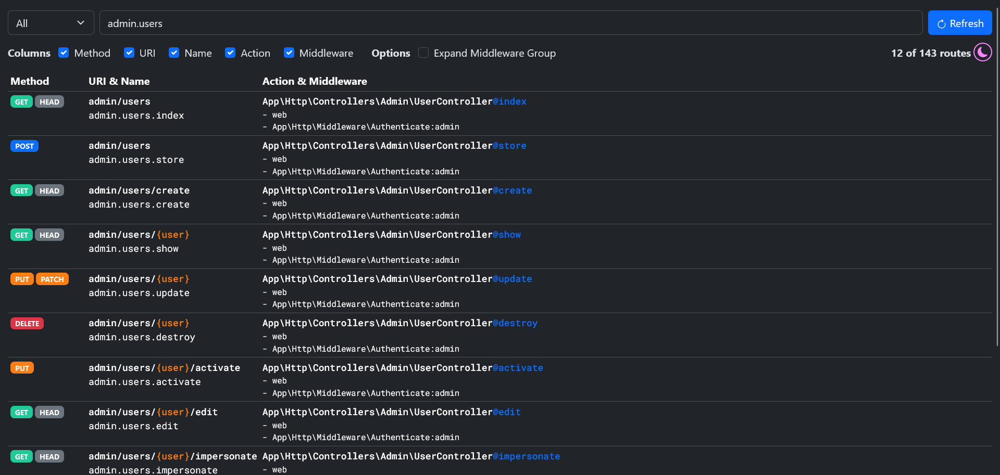

# Laravel Route List Web

[](https://packagist.org/packages/apih/laravel-route-list-web)
[](https://packagist.org/packages/apih/laravel-route-list-web)
[](https://packagist.org/packages/apih/laravel-route-list-web)

This package provides a way to view your Laravel app routes via a web browser.

## Screenshots

<details>
    <summary>Light Mode</summary>
    
</details>

<details>
    <summary>Dark Mode</summary>
    
</details>

## Requirements

- PHP: `^8.0`
- Laravel: `^8.0|^9.0|^10.0|^11.0`

## Installation

You can install the package via Composer:

```bash
composer require apih/laravel-route-list-web --dev
```

The `Apih\RouteListWeb\RouteListWebServiceProvider` class is auto-discovered and registered by default.

If you want to register it yourself, add the service provider in `config/app.php`:

```php
'providers' => [
    /*
     * Package Service Providers...
     */
    Apih\RouteListWeb\RouteListWebServiceProvider::class,
],
```

## Usage

To view the routes in a web browser, just open `/route:list` path. For example, if your app domain is `https://dev.test`, open `https://dev.test/route:list`.

## Security Vulnerabilities

If you discover any security related issues, please email <hafizuddin_83@yahoo.com> instead of using the issue tracker. Please prefix the subject with `Laravel Route List Web:`.

## Credits

- [Mohd Hafizuddin M Marzuki](https://github.com/apih)
- [All Contributors](../../contributors)

## License

The MIT License (MIT). Please see [License File](LICENSE.md) for more information.
